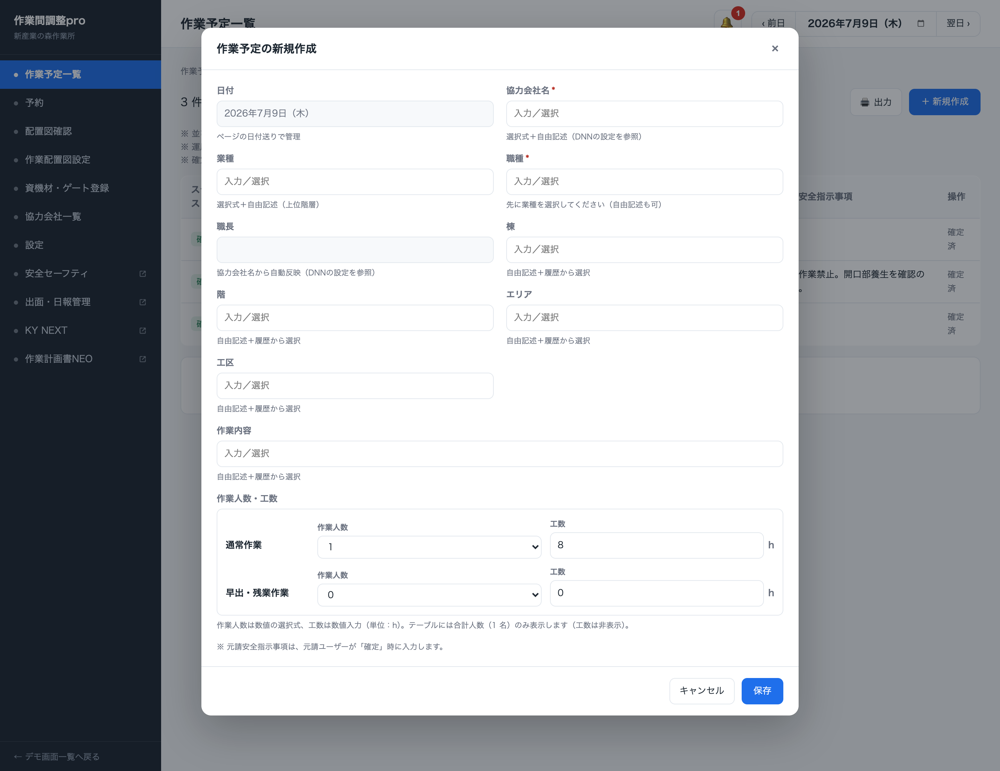
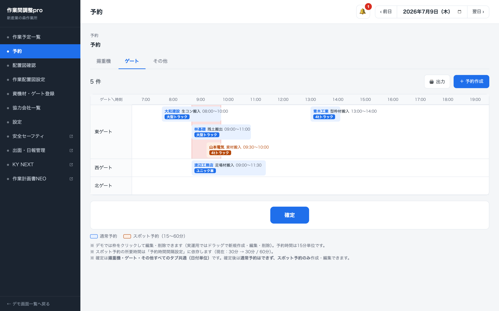
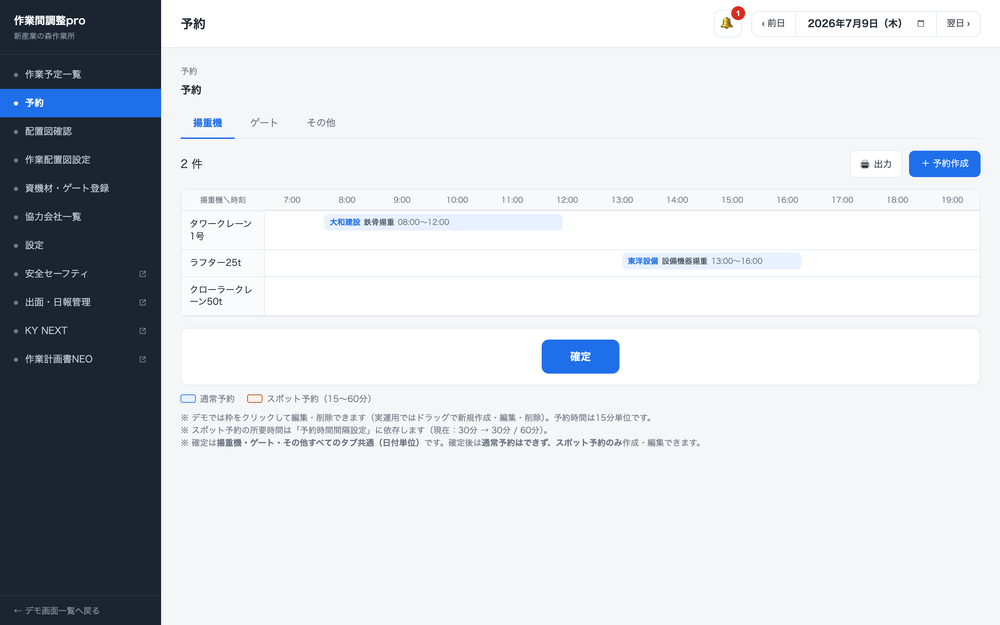
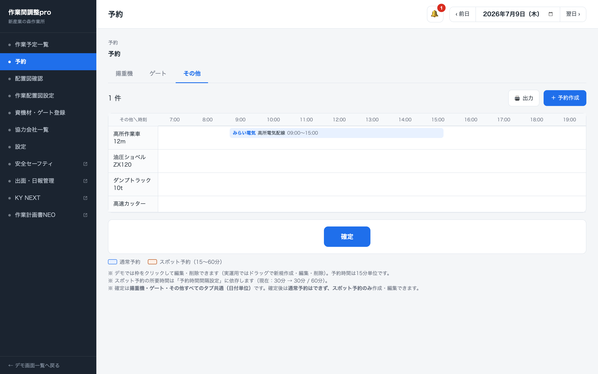
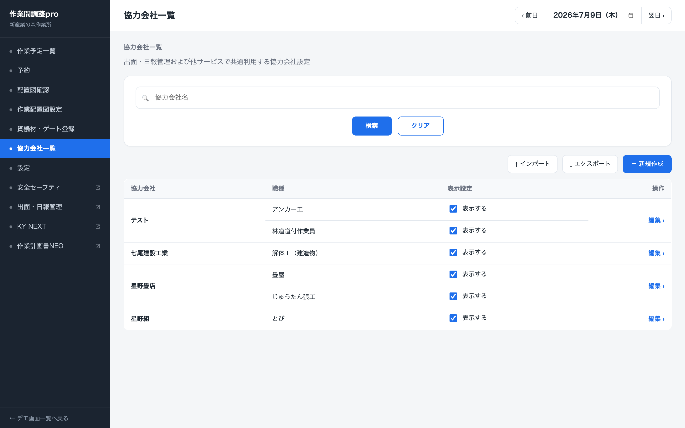
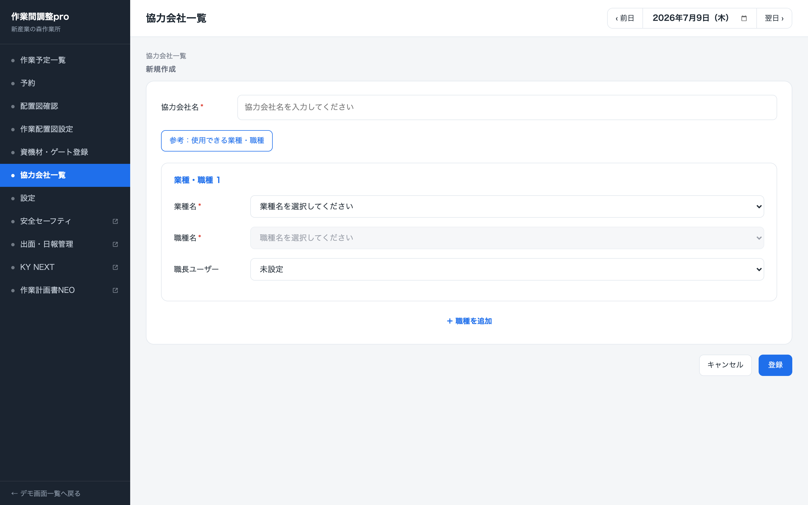

<!-- _class: title -->
<!-- _paginate: false -->

# 作業間調整pro 画面キャプチャ

/workadjust の各画面（1枚1ページ）

<small>デモ日付：2026年7月9日（木）／確定前は7月10日（金）</small>

---

##### 01-1. 作業予定一覧 — 確定後

---

##### 01-2. 作業予定一覧 — 確定前

---

##### 01-3. 作業予定一覧 — 出力

---

##### 02. 作業予定一覧 — 新規作成

---

##### 03. 作業予定一覧 — 実績入力

---

##### 04. 予約 — ゲート

---

##### 05. 予約 — 揚重機

---

##### 06. 予約 — その他

---

##### 07-1. 予約 — 予約作成ゲート

---

##### 07-2. 予約 — 予約作成揚重機

---

##### 07-3. 予約 — 出力

---

##### 08. 配置図確認

---

##### 09. 配置図確認 — 新規作成台紙選択

---

##### 10. 配置図確認 — 配置を追加

---

##### 11. 作業配置図設定 — 一覧

---

##### 12. 作業配置図設定 — 登録

---

##### 13. 作業配置図設定 — 詳細

---

##### 14. 資機材ゲート登録 — 揚重機

---

##### 15. 資機材ゲート登録 — ゲート

---

##### 16. 資機材ゲート登録 — 資機材

---

##### 17. 資機材ゲート登録 — 新規登録

---

##### 18. 資機材ゲート登録 — 一括登録

---

##### 19. 資機材ゲート登録 — 持込機械から同期

---

##### 20. 協力会社一覧

---

##### 21. 協力会社一覧 — 新規作成

---

##### 22. 設定 — 予約時間設定

---

##### 23. 設定 — 予約権限設定

---

##### 24. 設定 — 予約種類設定

---

##### 25. 設定 — 予約時間間隔設定

